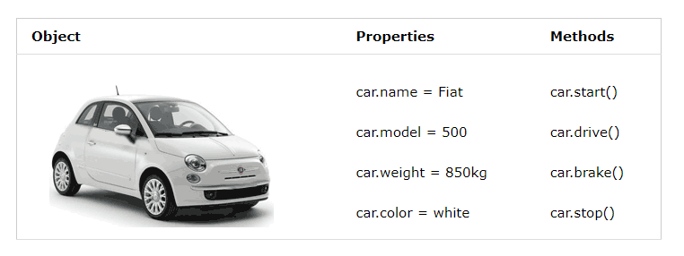

# JavaScript Objects
## Real Life Objects, Properties, and Methods
In real life, a car is an **object.**

A car has **properties** like weight and color, and **methods** like start and stop:


All cars have the same **properties**, but the property **values** differ from car to car.

All cars have the same **methods**, but the methods are performed **at different times.**


## JavaScript Objects
You have already learned that JavaScript variables are containers for data values.

This code assigns a **simple value** (Fiat) to a **variable** named car:

```javascript
let car = "Fiat";
```

Objects are variables too. But objects can contain many values.

This code assigns **many values** (Fiat, 500, white) to a **variable** named car:
```javascript
const car = {type:"Fiat", model:"500", color:"white"};
```

The values are written as **name:value** pairs (name and value separated by a colon).

It is a common practice to declare objects with the `const` keyword.

Learn more about using `const` with objects in the chapter: [JS Const.](https://www.w3schools.com/js/js_const.asp)


## Object Definition
You define (and create) a JavaScript object with an object literal:

### Example
```javascript
const person = {firstName:"John", lastName:"Doe", age:50 eyeColor:"blue"};
```

Spaces and line breaks are not important. An object definition can span multiple lines:

### Example
```javascript
const person = {
  firstName: "John",
  lastName: "Doe",
  age: 50,
  eyeColor: "blue"
};
```


## Object Properties
The **name:values** pairs in JavaScript objects are called **properties:**

| **Property** | **Property Value** |
|--------------|--------------------|
| firstName	| John |
| lastName	| Doe |
| age | 50 |
| eyeColor	| blue |


## Accessing Object Properties
You can access object properties in two ways:

```javascript
objectName.propertyName
```

or
```javascript
objectName["propertyName"]
```

### Example1
```javascript
person.lastName;
```

### Example2
```javascript
person["lastName"];
```

JavaScript objects are containers for **named values** called properties.


## Object Methods
Objects can also have **methods.**

Methods are **actions** that can be performed on objects.

Methods are stored in properties as **function definitions.**

| **Property** | **Property Value** |
|----------|----------------|
| firstName	| John |
| lastName	| Doe |
| age | 50 |
| eyeColor	| blue |
| fullName	| function() {return this.firstName + " " + this.lastName;} |

A method is a function stored as a property.

### Example
```javascript
const person = {
  firstName: "John",
  lastName : "Doe",
  id       : 5566,
  fullName : function() {
    return this.firstName + " " + this.lastName;
  }
};
```

In the example above, `this` refers to the **person object.**

I.E. **this.firstName** means the **firstName** property of **this**.

I.E. **this.firstName** means the **firstName** property of **person**.


## What is **this**?
In JavaScript, the `this` keyword refers to an **object.**

**Which** object depends on how `this` is being invoked (used or called).

The `this` keyword refers to different objects depending on how it is used:

| In an object method, `this` refers to the **object.** |
|-----|
| Alone, `this` refers to the **global object.** |
| In a function, `this` refers to the **global object.** |
| In a function, in strict mode, `this` is `undefined.` |
| In an event, `this` refers to the **element** that received the event. |
| Methods like `call()`, `apply()`, and `bind()` can refer `this` to **any object.** |


## Note
`this` is not a variable. It is a keyword. You cannot change the value of `this`.

## See Also:
[The JavaScript **this** Tutorial](https://www.w3schools.com/js/js_this.asp)


## The **this** Keyword
In a function definition, `this` refers to the "owner" of the function.

In the example above, `this` is the **person object** that "owns" the `fullName` function.

In other words, `this.firstName` means the `firstName` property of **this object.**

Learn more about this in [The JavaScript this Tutorial](https://www.w3schools.com/js/js_this.asp).


## Accessing Object Methods
You access an object method with the following syntax:
```javascript
objectName.methodName()
```

### Example
```javascript
name = person.fullName();
```

If you access a method **without** the () parentheses, it will return the **function definition**:

### Example
```javascript
name = person.fullName;
```


## Do Not Declare Strings, Numbers, and Booleans as Objects!
When a JavaScript variable is declared with the keyword "new", the variable is created as an object:
```javascript
x = new String();        // Declares x as a String object
y = new Number();        // Declares y as a Number object
z = new Boolean();       // Declares z as a Boolean object
```


Avoid `String`, `Number`, and `Boolean` objects. They complicate your code and slow down execution speed.

You will learn more about objects later in this tutorial.